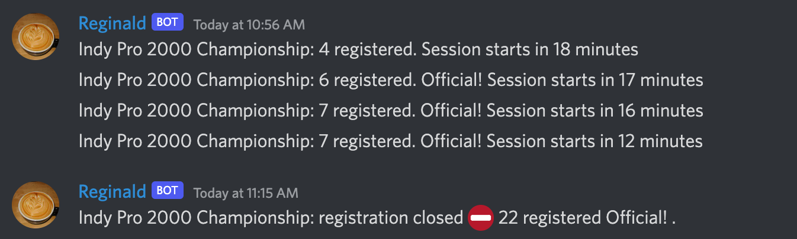

# Regbot

Regbot is a Discord bot for iRacing. It will announce to channel(s) when race registration for a series reaches a particular level. This
is useful for low participation series, as it allows people to easily watch the state of upcoming racings, and jump in to help it go official.

## Install

Open https://discord.com/api/oauth2/authorize?client_id=1012853239445737493&permissions=2112&scope=applications.commands%20bot in a browser
and go through the discord authn / authz dance. You'll need to be a server admin to install it to a server.

Goto a channel where you want the announcements and use the /watch command. Tab complete to pick the series, and set the optional settings
if you want. the /help command explains the settings. You can just do /watch again if you want to change the settings. Use /nomore to remove
a series, and /watching to list all the series being watched in the channel.

Consider if you want to restrict who can run /watch and /nomore, you might want to restrict these to an admin role.

## Ideas

- upcoming command to show when the next race is
- show track info in messages
- announce the new race week with track info

## DONE

- update season/series list on regular basis.
- improve time to session reporting.
- look at race guide expiry from ir
- fix issue with arg order handling
- command to list current watches
- remove bogus commands from sample code
- what happens when install in another server?
- restrict /reg to server admin? defined users?
- what happens during uninstall?
- command to remove a watch
- deal with series when user selects text, not one of the autocomplete options.
- command for help
